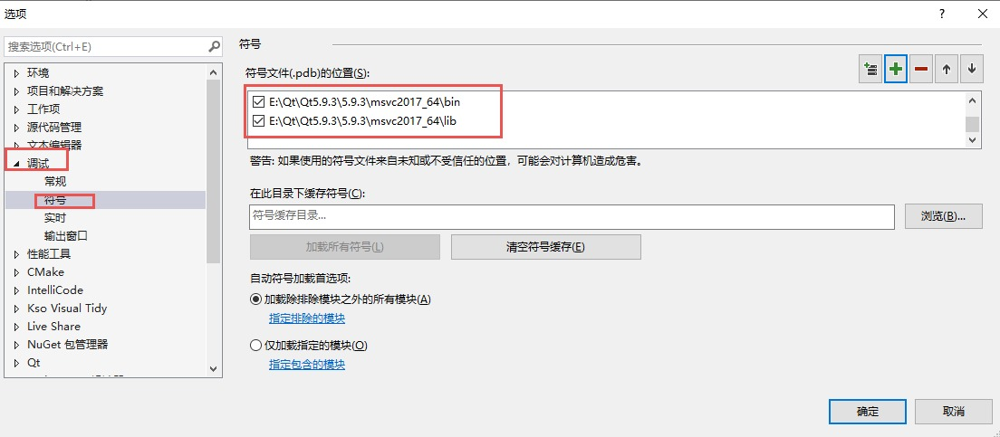
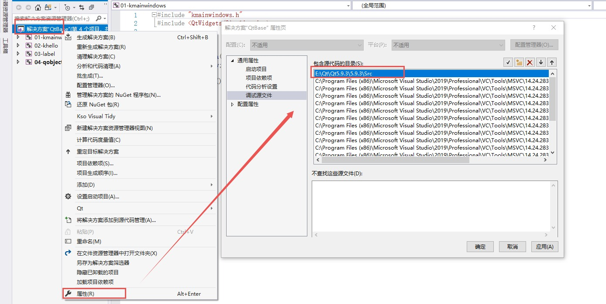

### 第一天：
#### Qt 的介绍、优点、成功案例  

.......

#### 配置QT运行环境

##### QT安装

- Qt5.9.3 安装包：[夸克网盘分享](https://pan.quark.cn/s/c5349d079385#/list/share)
- [qt-opensource-windows-x86-5.9.3.exe_免费高速下载|百度网盘-分享无限制](https://pan.baidu.com/s/11B53cGjDdvp_QWCGuY7Mxg)    提取码：947f


##### vs插件安装

- 安装qt-vsaddin插件：[qt-vsaddin-msvc2019-2.8.1](https://365.kdocs.cn/view/l/cpnWkMiDUx6a)   或是  [Index of /archive/vsaddin](https://download.qt.io/archive/vsaddin/) 安装好后关闭自动更新，在拓展   -->   Qt  Vs Tools --> Options  中 选择Versions，设置qmake.exe路径（Qt5.9.3\5.9.3\msvc2017_64\bin）

##### 源码调试

- 当安装 qt的时候，若是选择了下载 Qt 源码，在进行VS调试的时候就可以调试 qt源码。
- 源码默认位置::Qt5.9.3\5.9.3\Src
- 下载 pdb 调试符号相关数据


- [Index of /online/qtsdkrepository/windows_x86/desktop/qt5_593/qt.593.win64_msvc2017_64](https://download.qt.io/online/qtsdkrepository/windows_x86/desktop/qt5_593/qt.593.win64_msvc2017_64/)
- 解压下载好的 xx.7z包，存放到:Qt5.9.3\5.9.3 目录下，方便查找。弹出相同文件，选择全部跳过
- 新建一个 Qt 工程工程配置调试环境。准备配置环境
- 配置符号表位置，调试--选项，中的调试，符号，添加符号表路径



- 项目添加源码路径



##### Qt 项目模块配置

在 VS 中开发 Qt 程序时，需明确告诉编译器**项目依赖哪些 Qt 功能模块**（如界面控件、网络、多媒体等）。这些模块决定了代码能调用哪些 Qt API，比如：

- 做界面必须选 `Widgets` 模块
- 处理网络要选 `Network` 模块

通过这一步配置，让 VS + Qt 环境知道 “项目需要哪些 Qt 功能支持”。

右击项目打开项目属性，找到`Qt Project Settings`，在右侧选择 `Qt Modules` 选择框，勾选模块后，项目才能使用对应模块的 API（如用 `QPushButton` 必须依赖 `Widgets` 模块）。

##### 代码提交

使用vs编译工程的时候，实际上只需要三个部分就可以编译了，源代码+解决方案（.sln）+项目工程（.vcxproj），只需提交上述三种文件即可


#### 熟悉按钮控件常用 API  

项目基本框架如下，`MyWidget`类继承`QWidget`，用于显示窗口`MyWidget w;    w.show();`，其中在`MyWidget`构造函数中创建按钮。

多用帮助文档：Qt5.9.3\5.9.3\mingw53_32\bin\assistant.exe 查找控件方法。

##### mywidget.h

```c++
#pragma once

#include <QtWidgets/QWidget>
#include "ui_mywidget.h"
#include <qpushbutton.h>
#include <qdebug.h>


class MyWidget : public QWidget{
    Q_OBJECT

public:
    MyWidget(QWidget *parent = nullptr);
    ~MyWidget();

private:
    Ui::MyWidgetClass ui;
};

```


##### mywidget.cpp

```c++
#include "mywidget.h"

MyWidget::MyWidget(QWidget *parent)
    : QWidget(parent)
{
    ui.setupUi(this);

    //创建按钮对象
    QPushButton* btn = new QPushButton;
        
    //设置父类
    btn->setParent(this);
        
    //设置按钮文本    
    btn->setText(QString::fromLocal8Bit("成功"));
    qDebug() << QString::fromLocal8Bit("成功").toUtf8().data();

    QPushButton* btn2 = new QPushButton(QString::fromLocal8Bit("第二按钮"), this);
    //移动按钮2，不移动的的情况下会与按钮1在左上角重合
    btn2->move(100, 100);
    //设置按钮大小    
    btn2->resize(50, 50);

    //设置窗口标题    
    this->setWindowTitle(QString::fromLocal8Bit("QT第一个窗口"));

    //设置窗口大小不可变更    
    this->setFixedSize(600, 400);

}

MyWidget::~MyWidget()
{}
```

其中

##### main.cpp

```c++
#include "mywidget.h"
#include <QtWidgets/QApplication>

int main(int argc, char *argv[]){
    QApplication a(argc, argv);
    MyWidget w;
    w.show();
    return a.exec();
}
```

##### vs中输出乱码与qDebug双引号问题

```c++
 btn->setText(QString::fromLocal8Bit("成功"));
//为控件设置文本时需要使用fromLocal8Bit方法，不然会显示乱码

qDebug() << QString::fromLocal8Bit("成功").toUtf8().data();
//使用qDebug()输出调试信息时，同样需要fromLocal8Bit方法，使用.toUtf8().data()是为了去掉双引号

//同样的，使用 qDebug().noquote() 去掉双引号
qDebug().noquote() << QString::fromLocal8Bit("中文呢");

//字符串直接输出，不带双引号
qDebug("123");
```


##### vs运行代码不显示控制台问题

右击，项目属性，找到链接器，系统，子系统，选择控制台


#### 对象树的基本概念  

一定程度下，QT简化了内存回收机制，new出来的对象不用手动delete，也会被析构掉。但是前提是必须加到树上。从主到支的顺序new，从支到主顺序进行析构。所有 new 出来的对象 不用管释放，原因 `children` 表中的对象会在窗口关闭后进行自动释放


#### Qt 中的坐标系统  

原点在左上角，向右向下为 x，y 轴正方向


#### 信号和槽的基本使用以及拓展  

##### 基本使用方法

点击按钮，实现窗口关闭。

```c++
// 信号发送者，发送的信号，信号接收者，处理的槽函数
//connect(myBtn, &MyButton::clicked, this, &MyWidget::close);
connect(myBtn, &QPushButton::clicked, this, &QWidget::close);
```

##### 自定义信号与槽

定义教师类与学生类，需要继承QObject，使用Q_OBJECT宏才能使用信号与槽，信号需放在`signals:`下，只需声明无需实现，槽函数使用普通成员函数即可，发送信号使用`emit`关键字

###### Teacher.h 与 Teacher.cpp

```c++
//=============== Teacher.h ======================//
#pragma once
#include <qobject.h>

class Teacher : public QObject
{
	Q_OBJECT
public:
	explicit Teacher(QObject* parent = 0);

signals:
	//自定义信号 返回类型为void，信号只需要声明不需要实现，信号可以重载
	void hungry();

public slots:

};

//=============== Teacher.cpp ======================//

#include "Teacher.h"

Teacher::Teacher(QObject* parent) : QObject(parent)
{
}
```

###### Student.h 与 Student.cpp

```c++
//=============== Student.h ======================//
#pragma once
#include <qobject.h>
#include <qdebug.h>

class Student : public QObject
{
    Q_OBJECT
public:
    explicit Student(QObject* parent = 0);

    //自定义槽函数，返回值void，需要声明与实现，可重载
    void treat();

signals:

public slots:
    
};

//=============== Student.cpp ======================//

#include "Student.h"

Student::Student(QObject* parent) : QObject(parent)
{
}

void Student::treat()
{
	qDebug().noquote() << QString::fromLocal8Bit("请老师吃饭");
	qDebug() << QString::fromLocal8Bit("再请老师吃饭").toUtf8().data();
}

```

###### mywidget.cpp

```c++
//=============== mywidget.h ======================//
#pragma once

#include <QtWidgets/QWidget>
#include "ui_mywidget.h"
#include "Teacher.h"
#include "Student.h"

class MyWidget : public QWidget
{
    Q_OBJECT

public:
    MyWidget(QWidget *parent = nullptr);
    ~MyWidget();

    Teacher* zt;
    Student* st;


private:
    Ui::MyWidgetClass ui;
};

//=============== mywidget.cpp ======================//

#include "mywidget.h"

MyWidget::MyWidget(QWidget *parent)
    : QWidget(parent)
{
    zt = new Teacher(this);
    st = new Student(this);

    //连接老师和学生
    connect(zt, &Teacher::hungry, st, &Student::treat);

    //触发老师饿了的信号
    emit zt->hungry();

    ui.setupUi(this);
}

MyWidget::~MyWidget()
{}
```

通过 `connect` 链接信号与槽，使用 `emit zt->hungry();` 触发信号，实现 `Student::treat()` 槽函数的执行。


### 第二天：
#### 带菜单栏的窗口  

#### 资源文件  

#### 对话框  

#### 界面布局  

#### 常用控件  

#### 自定义控件  


### 第三天：
#### 事件处理  

#### 定时器  

#### Event 事件分发器  

#### 事件过滤器  

#### QPainter 绘图  

#### 绘图设备的使用  

#### QFile 文件读写操作  


### 第四天：
#### QQ 群聊软件  