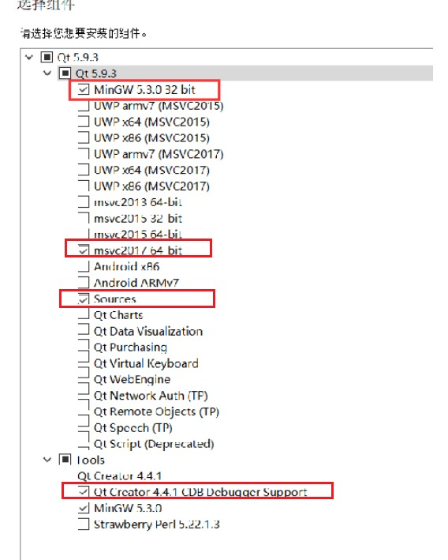
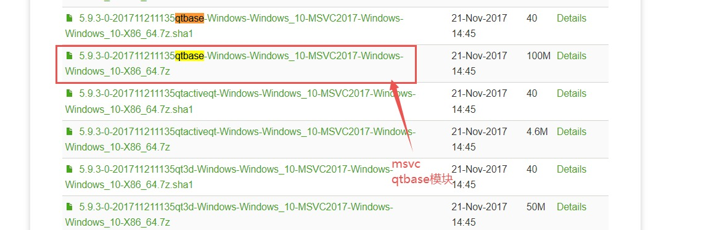

### 第一天：
#### Qt 的介绍、优点、成功案例  

.......

#### 配置QT运行环境

##### QT安装

- Qt5.9.3 安装包：[夸克网盘分享](https://pan.quark.cn/s/c5349d079385#/list/share)
- [qt-opensource-windows-x86-5.9.3.exe](https://pan.baidu.com/s/11B53cGjDdvp_QWCGuY7Mxg)    提取码：947f



##### vs插件安装

- 安装qt-vsaddin插件：[qt-vsaddin-msvc2019-2.8.1](https://365.kdocs.cn/view/l/cpnWkMiDUx6a)   或是  [Index of /archive/vsaddin](https://download.qt.io/archive/vsaddin/) 安装好后关闭自动更新，在拓展   -->   Qt  Vs Tools --> Options  中 选择Versions，设置qmake.exe路径（Qt5.9.3\5.9.3\msvc2017_64\bin）

##### 源码调试

- 当安装 qt的时候，若是选择了下载 Qt 源码，在进行VS调试的时候就可以调试 qt源码。
- 源码默认位置::Qt5.9.3\5.9.3\Src
- 下载 pdb 调试符号相关数据



- [Index of /online/qtsdkrepository/windows_x86/desktop/qt5_593/qt.593.win64_msvc2017_64](https://download.qt.io/online/qtsdkrepository/windows_x86/desktop/qt5_593/qt.593.win64_msvc2017_64/)
- 解压下载好的 xx.7z包，存放到:Qt5.9.3\5.9.3 目录下，方便查找。弹出相同文件，选择全部跳过
- 新建一个 Qt 工程工程配置调试环境。准备配置环境
- 配置符号表位置，调试--选项，中的调试，符号，添加符号表路径


- 项目添加源码路径


##### Qt 项目模块配置

在 VS 中开发 Qt 程序时，需明确告诉编译器**项目依赖哪些 Qt 功能模块**（如界面控件、网络、多媒体等）。这些模块决定了代码能调用哪些 Qt API，比如：

- 做界面必须选 `Widgets` 模块
- 处理网络要选 `Network` 模块

通过这一步配置，让 VS + Qt 环境知道 “项目需要哪些 Qt 功能支持”。

右击项目打开项目属性，找到`Qt Project Settings`，在右侧选择 `Qt Modules` 选择框，勾选模块后，项目才能使用对应模块的 API（如用 `QPushButton` 必须依赖 `Widgets` 模块）。

##### 代码提交

使用vs编译工程的时候，实际上只需要三个部分就可以编译了，源代码+解决方案（.sln）+项目工程（.vcxproj），只需提交上述三种文件即可


#### 熟悉按钮控件常用 API  

项目基本框架如下，`MyWidget`类继承`QWidget`，用于显示窗口`MyWidget w;    w.show();`，其中在`MyWidget`构造函数中创建按钮。

多用帮助文档：Qt5.9.3\5.9.3\mingw53_32\bin\assistant.exe 查找控件方法。

##### mywidget.h

```c++
#pragma once

#include <QtWidgets/QWidget>
#include "ui_mywidget.h"
#include <qpushbutton.h>
#include <qdebug.h>


class MyWidget : public QWidget{
    Q_OBJECT

public:
    MyWidget(QWidget *parent = nullptr);
    ~MyWidget();

private:
    Ui::MyWidgetClass ui;
};

```


##### mywidget.cpp

```c++
#include "mywidget.h"

MyWidget::MyWidget(QWidget *parent)
    : QWidget(parent)
{
    ui.setupUi(this);

    //创建按钮对象
    QPushButton* btn = new QPushButton;
        
    //设置父类
    btn->setParent(this);
        
    //设置按钮文本    
    btn->setText(QString::fromLocal8Bit("成功"));
    qDebug() << QString::fromLocal8Bit("成功").toUtf8().data();

    QPushButton* btn2 = new QPushButton(QString::fromLocal8Bit("第二按钮"), this);
    //移动按钮2，不移动的的情况下会与按钮1在左上角重合
    btn2->move(100, 100);
    //设置按钮大小    
    btn2->resize(50, 50);

    //设置窗口标题    
    this->setWindowTitle(QString::fromLocal8Bit("QT第一个窗口"));

    //设置窗口大小不可变更    
    this->setFixedSize(600, 400);

}

MyWidget::~MyWidget()
{}
```

其中

##### main.cpp

```c++
#include "mywidget.h"
#include <QtWidgets/QApplication>

int main(int argc, char *argv[]){
    QApplication a(argc, argv);
    MyWidget w;
    w.show();
    return a.exec();
}
```

##### vs中输出乱码与qDebug双引号问题

```c++
 btn->setText(QString::fromLocal8Bit("成功"));
//为控件设置文本时需要使用fromLocal8Bit方法，不然会显示乱码

qDebug() << QString::fromLocal8Bit("成功").toUtf8().data();
//使用qDebug()输出调试信息时，同样需要fromLocal8Bit方法，使用.toUtf8().data()是为了去掉双引号

//同样的，使用 qDebug().noquote() 去掉双引号
qDebug().noquote() << QString::fromLocal8Bit("中文呢");

//字符串直接输出，不带双引号
qDebug("123");
```


##### vs运行代码不显示控制台问题

右击，项目属性，找到链接器，系统，子系统，选择控制台


##### vs查看代码，配色不显示问题

在 VS2019 中一个解决方案下不同项目出现代码配色显示差异，可能是项目加载与缓存问题。

- 尝试右键解决方案 →“重新生成解决方案”“清理解决方案” 后重新加载项目
- VS 缓存数据异常影响了项目的显示，关闭 VS，找到解决方案目录下的 `.vs` 隐藏文件夹，将其删除，然后重新打开 VS 加载项目。


#### 对象树的基本概念  

一定程度下，QT简化了内存回收机制，new出来的对象不用手动delete，也会被析构掉。但是前提是必须加到树上。从主到支的顺序new，从支到主顺序进行析构。所有 new 出来的对象 不用管释放，原因 `children` 表中的对象会在窗口关闭后进行自动释放


#### Qt 中的坐标系统  

原点在左上角，向右向下为 x，y 轴正方向


#### 信号和槽的基本使用以及拓展  

##### 基本使用方法

点击按钮，实现窗口关闭。

```c++
// 信号发送者，发送的信号，信号接收者，处理的槽函数
//connect(myBtn, &MyButton::clicked, this, &MyWidget::close);
connect(myBtn, &QPushButton::clicked, this, &QWidget::close);
```

##### 自定义信号与槽

定义教师类与学生类，需要继承QObject，使用Q_OBJECT宏才能使用信号与槽，信号需放在`signals:`下，只需声明无需实现，槽函数使用普通成员函数即可，发送信号使用`emit`关键字

###### Teacher.h 与 Teacher.cpp

```c++
//=============== Teacher.h ======================//
#pragma once
#include <qobject.h>

class Teacher : public QObject
{
	Q_OBJECT
public:
	explicit Teacher(QObject* parent = 0);

signals:
	//自定义信号 返回类型为void，信号只需要声明不需要实现，信号可以重载
	void hungry();

public slots:

};

//=============== Teacher.cpp ======================//

#include "Teacher.h"

Teacher::Teacher(QObject* parent) : QObject(parent)
{
}
```

###### Student.h 与 Student.cpp

```c++
//=============== Student.h ======================//
#pragma once
#include <qobject.h>
#include <qdebug.h>

class Student : public QObject
{
    Q_OBJECT
public:
    explicit Student(QObject* parent = 0);

    //自定义槽函数，返回值void，需要声明与实现，可重载
    void treat();

signals:

public slots:
    
};

//=============== Student.cpp ======================//

#include "Student.h"

Student::Student(QObject* parent) : QObject(parent)
{
}

void Student::treat()
{
	qDebug().noquote() << QString::fromLocal8Bit("请老师吃饭");
	qDebug() << QString::fromLocal8Bit("再请老师吃饭").toUtf8().data();
}

```

###### mywidget.cpp

```c++
//=============== mywidget.h ======================//
#pragma once

#include <QtWidgets/QWidget>
#include "ui_mywidget.h"
#include "Teacher.h"
#include "Student.h"

class MyWidget : public QWidget
{
    Q_OBJECT

public:
    MyWidget(QWidget *parent = nullptr);
    ~MyWidget();

    Teacher* zt;
    Student* st;


private:
    Ui::MyWidgetClass ui;
};

//=============== mywidget.cpp ======================//

#include "mywidget.h"

MyWidget::MyWidget(QWidget *parent)
    : QWidget(parent)
{
    zt = new Teacher(this);
    st = new Student(this);

    //连接老师和学生
    connect(zt, &Teacher::hungry, st, &Student::treat);

    //触发老师饿了的信号
    emit zt->hungry();

    ui.setupUi(this);
}

MyWidget::~MyWidget()
{}
```

通过 `connect` 链接信号与槽，使用 `emit zt->hungry();` 触发信号，实现 `Student::treat()` 槽函数的执行。


##### 带参数的信号与槽

```c++

//=============== Teacher.h ======================//
void hungry(QString foodName);

//=============== Student.h ======================//
void treat(QString foodName);

//=============== Student.cpp ======================//
void Student::treat(QString foodName){
	QString str = QString::fromLocal8Bit("请老师吃饭，老师要吃") + foodName;
	qDebug() << str.toUtf8().data();
}


//=============== mywidget.cpp ======================//
void(Teacher:: * teacherSignal)(QString) = &Teacher::hungry;
void(Student:: * studentSlot)(QString) = &Student::treat;
// 有参的 信号与槽连接
connect(zt, teacherSignal, st, studentSlot);

emit zt->hungry(QString::fromLocal8Bit("宫保鸡丁"));
```

利用函数指针来明确指向哪一个重载函数，原先的写法会失效。

- 断开信号与槽`disconnect(zt, noTeacherSignal, st, noStudentSlot);`
- 一个信号可连接多个槽函数，同理，多个信号也能连接一个槽函数
- 信号与槽参数类型必须一一对应，个数不必对应，信号参数量 ≥ 槽函数即可

##### lambda表达式

```c++
//mutable 改变值传递的内部变量、返回值 []()->type {};
QPushButton* btn2 = new QPushButton("aaaaa", this);
btn2->move(200, 0);
//此处只能用=号（值传递），使用&（引用传递）会报错，做信号与槽操作时，默认内部变量会进行锁状态，只允许只读操作，若使用引用传递会导致程序终止。
connect(btn2, &QPushButton::clicked, [=]() {
    btn2->setText("bbbbb");
});
```


### 第二天：
#### 带菜单栏的窗口  

其中菜单项，工具项，可以使用ui创建的，也能使用代码创建的，不具唯一性的多用`add`方法，具备唯一性的多用`set`方法。

```c++
#include "mainwindow.h"

MainWindow::MainWindow(QWidget *parent)
    : QMainWindow(parent)
{
    ui.setupUi(this);
/************************************************************************/
/*  菜单栏                                                              */
/************************************************************************/
    QMenuBar* bar = menuBar();

    // 通过菜单栏添加菜单
    QMenu * fileMenu = bar->addMenu(QS8("文件"));
    QMenu * editMenu = bar->addMenu(QS8("编辑"));

    //添加菜单项
    QAction* newAction = fileMenu->addAction(QS8("新建"));
    fileMenu->addSeparator(); //添加分割线
    QAction* openAction = fileMenu->addAction(QS8("打开"));

/************************************************************************/
/*  工具栏                                                               */
/************************************************************************/
    addToolBar(Qt::LeftToolBarArea, ui.mainToolBar);
    //只允许左右侧停靠
    ui.mainToolBar->setAllowedAreas(Qt::LeftToolBarArea | Qt::RightToolBarArea);
    //设置浮动
    ui.mainToolBar->setFloatable(false);
    //设置移动
    ui.mainToolBar->setMovable(false);
    //添加菜单项
    ui.mainToolBar->addAction(newAction);
    ui.mainToolBar->addSeparator();
    ui.mainToolBar->addAction(openAction);

/************************************************************************/
/*  状态栏  只能有一个                                                   */
/************************************************************************/
    ui.statusBar->addWidget(new QLabel(QS8("提示信息"), this));
    ui.statusBar->addPermanentWidget(new QLabel(QS8("右侧提示信息"), this));

/************************************************************************/
/*  铆接部件 浮动窗口                                                    */
/************************************************************************/
    QDockWidget* dock = new QDockWidget;
    // 添加铆接部件到下侧，如果没有QWidget *centralWidget;，则铆接部件看起来在上册，因为其是围绕核心部件来
    addDockWidget(Qt::BottomDockWidgetArea, dock);
    dock->setAllowedAreas(Qt::TopDockWidgetArea | Qt::BottomDockWidgetArea);

    //设置图标
    newAction->setIcon(QIcon("../ui/open.png"));

}
```


#### 资源文件  

确保**项目路径无中文**。且资源文件需要与`.qrc`文件处于同级目录下

在vs中打开`.qrc`文件，利用`“Add Prefix"`添加前缀，`“Add Files”`添加资源文件。在开发大型项目时候，需要为不同系列的资源添加不同的前缀来加以区分，比如枪械类资源可以添上前缀“\Gun”，人物类资源可以添上前缀"\Character”。设置完毕后点击左上角保存按钮即可。使用方法如下：

```c++
mainWindow::mainWindow(QWidget *parent)
    : QMainWindow(parent){
    ui.setupUi(this);

    ui.actionnew->setIcon(QIcon(":/ui/ui/open.png"));
    ui.actionopen->setIcon(QIcon(":/ui/ui/exit.png"));
}
```

使用格式为`“:/前缀 + 资源路径”`，上述使用代码中前缀为`/ui`，资源路径为`.qrc`文件同级目录下的`ui`文件夹中。

#### 对话框  

- 模态对话框
- 非模态对话框
- 标准对话框
  - 错误
  - 信息
  - 警告
  - 问题
- 颜色对话框
- 文件对话框

```c++
#include "mainwindow.h"
#include <qdebug.h>
#include <qdialog.h>
#include <qmessagebox.h>
#include <qcolordialog.h>
#include <qfiledialog.h>
mainWindow::mainWindow(QWidget *parent)
    : QMainWindow(parent)
{
    ui.setupUi(this);

    connect(ui.actionExit, &QAction::triggered, [=]() {
        this->close();
        });

    connect(ui.actionNew, &QAction::triggered, [=]() {
        // 模态对话框：只能对对话框操作
        // 非模态对话框：不仅仅能对对话框操作

        //QDialog dlg(this);
        //dlg.resize(200, 200); // 尺寸不设置或者设置偏小会弹出警告
        //dlg.exec();
        //qDebug() << QS8("弹出对话框").toUtf8().data();
        //qDebug().noquote() << QS8("弹出对话框");


        // QDialog dlg2(this); //创建到栈上，一闪而过
        //QDialog* dlg2 = new QDialog(this); //创建到堆上，持续保存
        //dlg2->resize(200, 200); // 尺寸不设置或者设置偏小会弹出警告
        //dlg2->show(); //非模态
        //dlg2->setAttribute(Qt::WA_DeleteOnClose); //关闭该窗口时释放内存

        //使用标准对话框
        // QMessageBox::critical(this, QS8("错误"), "critical");
        // QMessageBox::information(this, QS8("信息"), "info");
        // QMessageBox::warning(this, QS8("警告"), QS8("warning"));
        auto btn = QMessageBox::question(this, QS8("问题"), "question", QMessageBox::Save | QMessageBox::Cancel, QMessageBox::Cancel); //会有两个按钮，最后一个参数选择默认按钮
        if (btn == QMessageBox::Save) {
            qDebug().noquote() << QS8("点击的是保存");
        }
        else{
            qDebug().noquote() << QS8("点击的是取消");
        }      

        // 颜色对话框
        //QColor color = QColorDialog::getColor(QColor(0, 0, 0));
        //qDebug() << color.red() << color.green() << color.blue();

        // 文件对话框，getOpenFileName 返回QString
        qDebug() << QFileDialog::getOpenFileName(this, QS8("打开文件"),"C:\\Users\\asus\\Desktop", "(*.txt)");
    });
}

mainWindow::~mainWindow()
{}

```


#### 界面布局  

直接通过.ui文件对界面进行布局，双击打开vs中的ui文件，可选择默认打开方式，选择Qt Creator，打开后拖选相应控件进行布局即可。


#### 常用控件  

##### 按钮组

- pushbutton，常用基本按钮

- toolbutton， 常用于显示图片

- radio button， 单选按钮，需要Group Box进行框住分组

- Check button，复选按钮

##### ListWidget

列表控件，在其中添加`QListWidgetLitem`项，一行行显示


##### TreeWidgetItem

- 添加Tree的头，可添加一个，也能添加多个。
- 添加顶层项目，使用  `treewidget->addTopLevelItem` 添加   `QTtreeWidgetItem`
- `QTtreeWidgetItem` 使用 `addchild` 添加子项，子项也是`QTtreeWidgetItem`


##### QTableWidget

先在ui文件中添加`tableWidget`

```c++
#include "mainwindow.h"
#include "qmessagebox.h"
mainWindow::mainWindow(QWidget *parent)
    : QWidget(parent)
{
    ui.setupUi(this);

    QStringList list;
    list << QS8("姓名") << QS8("性别") << QS8("年龄");
    ui.tableWidget->setColumnCount(list.size());
    ui.tableWidget->setHorizontalHeaderLabels(list);

    ui.tableWidget->setRowCount(5);

    ui.tableWidget->setItem(0, 0, new QTableWidgetItem(QS8("亚瑟")));

    //准备数据
    QStringList nameList, sexList;
    nameList << QS8("亚瑟") << QS8("妲己") << QS8("李白") << QS8("鲁班") << QS8("裴擒虎");
    sexList << QS8("男") << QS8("女") << QS8("男") << QS8("男") << QS8("男");

    for (int i = 0; i < 5; i++)
    {
        int col = 0;
        ui.tableWidget->setItem(i, col++, new QTableWidgetItem(nameList[i]));
        ui.tableWidget->setItem(i, col++, new QTableWidgetItem(sexList[i]));
        ui.tableWidget->setItem(i, col++, new QTableWidgetItem(QString::number(i+18)));
    }

    //点击按钮进行添加与删除
    connect(ui.addBtn, &QPushButton::clicked, [=]() {
        //先判断有无赵云,findItems会返回一个列表
        bool isEmpty = ui.tableWidget->findItems(QS8("赵云"), Qt::MatchExactly).empty();
        if (isEmpty){
            ui.tableWidget->insertRow(0);
            ui.tableWidget->setItem(0, 0, new QTableWidgetItem(QS8("赵云")));
            ui.tableWidget->setItem(0, 1, new QTableWidgetItem(QS8("男")));
            ui.tableWidget->setItem(0, 2, new QTableWidgetItem(QString::number(20)));
        }
        else
        {
            QMessageBox::warning(this, QS8("警告!"), QS8("已经有赵云了！"));
        }
        });

    connect(ui.delBtn, &QPushButton::clicked, [=]() {
        QList<QTableWidgetItem*> list = ui.tableWidget->findItems(QS8("赵云"), Qt::MatchExactly);
        if (list.empty()) {
            QMessageBox::warning(this, QS8("警告!"), QS8("未找到赵云！"));
        }
        else
        {
            int row = list.first()->row();
            ui.tableWidget->removeRow(row);
        }
        });
}

mainWindow::~mainWindow()
{}
```


### 第三天：

#### 自定义控件  

通过新添加`.ui`文件以及对应的`.h`与`.cpp`文件，在`ui`文件中绘制自己所需的控件，譬如`QSpinBox`与`QSlider`相组合。

右击项目，添加新建项，选择`Qt`中的`Qt Widgets Class`，设置好类名，进行相应文件的添加。然后在主`ui`中添加`widget`，将其提升为新添加的类，然后在自定义控件类中书写控件组合逻辑，运行代码。

其中`ui_smallwidget.h`会自动生成。

##### smallwidget.h

```c++
#pragma once
#include <qwidget.h>
#include "ui_smallwidget.h"

class SmallWidget :  public QWidget
{
    Q_OBJECT

public:
    SmallWidget(QWidget* parent = nullptr);
    ~SmallWidget();

private:
    Ui::Form ui;
};
```

##### smallwidget.cpp

```c++
#include "smallwidget.h"

SmallWidget::SmallWidget(QWidget* parent)
    : QWidget(parent)
{
    ui.setupUi(this);

    // 计数器带着水平条
    void(QSpinBox:: * spinboxSign)(int) = &QSpinBox::valueChanged;
    connect(ui.spinBox, spinboxSign, ui.horizontalSlider, &QSlider::setValue);

    //水平条带着计数器
    connect(ui.horizontalSlider, &QSlider::valueChanged, ui.spinBox, &QSpinBox::setValue);

}

SmallWidget::~SmallWidget()
{}
```


#### 事件处理  

设计鼠标进入与离开widget事件，通过重写函数实现。

##### mainWindow.h

```c++
#pragma once

#include <QtWidgets/QWidget>
#include "ui_mainwindow.h"

class mainWindow : public QWidget
{
    Q_OBJECT

public:
    mainWindow(QWidget *parent = nullptr);
    ~mainWindow();

    // 鼠标事件
    void enterEvent(QEvent*) override;
    void leaveEvent(QEvent*) override;
    void mousePressEvent(QMouseEvent* ev) override;
    void mouseReleaseEvent(QMouseEvent*) override;
    void mouseMoveEvent(QMouseEvent* ev) override;

    // 定时器事件
    void timerEvent(QTimerEvent *e) override;
private:
    Ui::mainWindowClass ui;

    int id1;
    int id2;
};

```

##### mainWindow.cpp

```c++
#include "mainwindow.h"
#include "qdebug.h"
#include "QMouseEvent"
#include "QTimerEvent"

mainWindow::mainWindow(QWidget *parent)
    : QWidget(parent)
{
    // this->setMouseTracking(true);  无需鼠标按下也能捕获到鼠标的移动，默认为False

    id1 = startTimer(1000); //一秒种触发一次
    id2 = startTimer(2000); //一秒种触发一次

    ui.setupUi(this);
}

mainWindow::~mainWindow()
{}

void mainWindow::enterEvent(QEvent*)
{
    qDebug().noquote() << QString::fromLocal8Bit("鼠标进入事件触发");
}

void mainWindow::leaveEvent(QEvent*)
{
    qDebug().noquote() << QString::fromLocal8Bit("鼠标离开事件触发");
}

void mainWindow::mousePressEvent(QMouseEvent* ev)
{
    if (ev->button() == Qt::LeftButton)
    {
        qDebug().noquote() << QString::fromLocal8Bit("鼠标按下事件触发，x = %1 ,y = %2").arg(ev->x()).arg(ev->y());
    }
    
}

void mainWindow::mouseReleaseEvent(QMouseEvent*)
{
    qDebug().noquote() << QString::fromLocal8Bit("鼠标释放事件触发");
}

void mainWindow::mouseMoveEvent(QMouseEvent* ev)
{
    //持续状态 需要用buttons  用与操作符 进行判断 (buttons()相当于集合了左右中三个键)
    if (ev->buttons() & Qt::LeftButton)
    {
        qDebug().noquote() << QString::fromLocal8Bit("鼠标移动事件触发");
    }
    
}

void mainWindow::timerEvent(QTimerEvent *e)
{
    if (e->timerId() == id1)
    {
        static int num = 0;
        ui.label->setText(QString::number(num++));
    }
    if (e->timerId() == id2)
    {
        static int num2 = 0;
        ui.label_2->setText(QString::number(num2++));
    }
}
```


#### 定时器  

 同样，重新定时器事件即可

```c++
void mainWindow::timerEvent(QTimerEvent *e)
{
    if (e->timerId() == id1)
    {
        static int num = 0;
        ui.label->setText(QString::number(num++));
    }
    if (e->timerId() == id2)
    {
        static int num2 = 0;
        ui.label_2->setText(QString::number(num2++));
    }


}

```


#### Event 事件分发器  

```c++
// 事件分发 event事件
bool event(QEvent* e) override;
    

bool mainWindow::event(QEvent* e)
{
    if (e->type() == QEvent::MouseButtonPress)
    {
        QMouseEvent* ev = static_cast<QMouseEvent*>(e);
        qDebug().noquote() << QString::fromLocal8Bit("QEvent::鼠标按下事件触发，x = %1 ,y = %2").arg(ev->x()).arg(ev->y());

        return true;
    }
    return QWidget::event(e);
}
```

通过重写`event`函数来进行事件的拦截，只传递执行自己所需的事件。在函数中想要用到`QMouseEvent`类成员，从父类转换到子类，使用`static_cast`。


#### 事件过滤器  

#### QPainter 绘图  

#### 绘图设备的使用  

#### QFile 文件读写操作  


### 第四天：
#### QQ 群聊软件  
